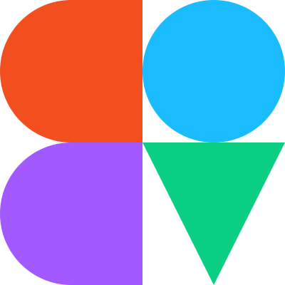

`figma-plugin-ds-vue` is a Vue `v2.x` component library that matches the Figma Design System for building Figma plugins. The library contains a set of handcrafted Vue components such as icons, buttons and other form elements that make it easy to create a plugin frontend that blends seamlessly into the Figma UI ✨🌈

This project is based on [@Thomas Lowrys](https://github.com/thomas-lowry) [figma-plugin-ds-svelte package](https://github.com/thomas-lowry/figma-plugin-ds-svelte) and can be seen as a fork of his svelte library.

## ✨ Installation

1.  Install the package `npm i figma-plugin-ds-vue`

2.  Include the global stylesheet in your app (either on component-level or make it accessible globally by importing it to your app's entry file, ex: `main.js`)

    `import 'figma-plugin-ds-vue/dist/figma-plugin-ds-vue.css'`

3.  Import and register the Vue components you want to use, refer to the [documentation](https://figma-plugin-ds-vue.netlify.app/) for details and an overview of all avaiable components

4.  Enjoy building your plugin 💻✨

## 📝 Documentation

Refer to the library's [documentation](https://figma-plugin-ds-vue.netlify.app/docs/components.html) for a detailed overview of each component and its usage.

Quick reference:

-   [Button](https://figma-plugin-ds-vue.netlify.app/docs/components.html#button)
-   [Checkbox](https://figma-plugin-ds-vue.netlify.app/docs/components.html#checkbox)
-   [Disclosure](https://figma-plugin-ds-vue.netlify.app/docs/components.html#disclosure)
-   [Icon](https://figma-plugin-ds-vue.netlify.app/docs/components.html#icon)
-   [Icon Button](https://figma-plugin-ds-vue.netlify.app/docs/components.html#icon-button)
-   [Input](https://figma-plugin-ds-vue.netlify.app/docs/components.html#input)
-   [Label](https://figma-plugin-ds-vue.netlify.app/docs/components.html#label)
-   [Onboarding](https://figma-plugin-ds-vue.netlify.app/docs/components.html#onboarding)
-   [Radio](https://figma-plugin-ds-vue.netlify.app/docs/components.html#radio)
-   [Select](https://figma-plugin-ds-vue.netlify.app/docs/components.html#select)
-   [Switch](https://figma-plugin-ds-vue.netlify.app/docs/components.html#switch)
-   [Text](https://figma-plugin-ds-vue.netlify.app/docs/components.html#text)
-   [Textarea](https://figma-plugin-ds-vue.netlify.app/docs/components.html#textarea)
-   [Title](https://figma-plugin-ds-vue.netlify.app/docs/components.html#title)
-   [Visual Bell](https://figma-plugin-ds-vue.netlify.app/docs/components.html#visual-bell)

The global stylesheet also includes [style variables](https://figma-plugin-ds-vue.netlify.app/docs/style-variables.html)🎨 and [utility classes](https://figma-plugin-ds-vue.netlify.app/docs/style-utilities.html)🧰 which can be used throughout your plugin 🌈

## 🚧 Roadmap

This project is a work-in-progress, here's a small roadmap:

⬜ `FigDisclosure` component should control its `FigDisclosureItem` child and prevent it from opening multiple disclosure menus at the same time  
⬜ Update documentation and create a meaningful order for the component overview (sorted alphabetically atm)  
⬜ Add detailed description of each component (context/usage?)  
...  
⬜ Update the library to Vue `v3.x` (since `v-model` changed with Vue 3 this would introduce breaking changes)

## 🌀 Misc

This project is based on [@Thomas Lowry's](https://github.com/thomas-lowry) [figma-plugin-ds-svelte package](https://github.com/thomas-lowry/figma-plugin-ds-svelte) and can be seen as a fork of his svelte library. It also includes refactored components of [@Morglod's](https://github.com/Morglod) [figma-vue-boilerplate](https://github.com/Morglod/figma-vue-boilerplate), a project which basically kickstarted the development of this one. S/o to these amazing humans 👋

## 📝 License

[MIT](LICENSE)
